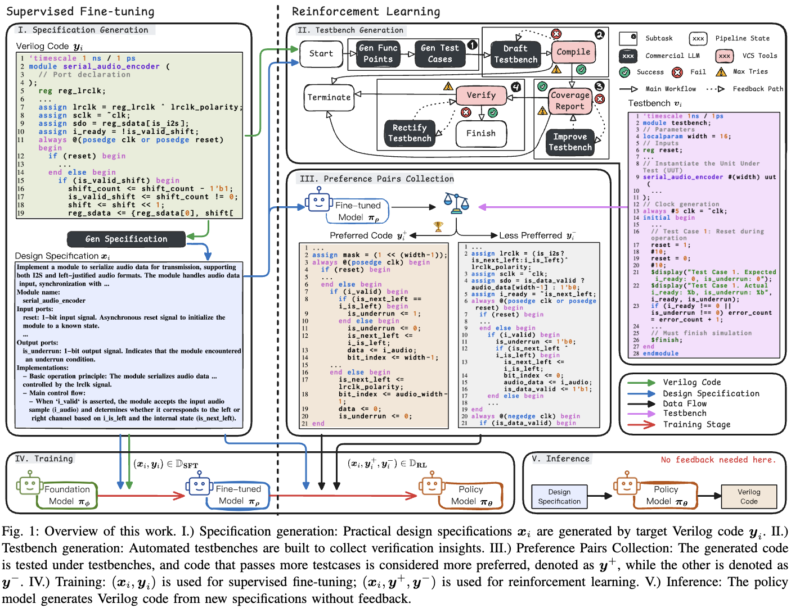

# Verilog Generation with Reinforcement Learning

This is the official implementation for the paper "Insights from Verification: Training a Verilog Generation LLM with Reinforcement Learning from Testbench Feedback"

## Introduction

This repository contains the code and data for training a Verilog generation model using reinforcement learning (RL) with feedback from testbenches. The goal is to improve the quality of generated Verilog code by leveraging the verification insights.


## Requirements

- vllm 0.7.2 [vllm](https://github.com/vllm-project/vllm)
- llamafactory-cli 0.9.3 [llamafactory](https://github.com/hiyouga/LLaMA-Factory)
- vcs2018

## Dataset Preparation

### SFT: Pyra

The Pyra dataset is located at [pyra](https://huggingface.co/datasets/LLM-EDA/pyra).
Download the json file and put it under `data/sft`.

### Collect Responses

The propmt dataset to collect pairs is located at [pyra_medium](https://huggingface.co/datasets/LLM-EDA/pyra_medium).
Download the json file and put it under `data/dpo`.

### Generate Pairs

First download the testbench dataset from [pyra_tb](https://huggingface.co/datasets/LLM-EDA/pyra_tb).
Put it under `data/dpo`.

If you have installed vcs2018, you can generate the pairs by running the following command:

```bash
bash scripts/vllm/gen_sft.sh /path/to/model /path/to/save.json
```

Or you can download qwen_7B response as an example from [qwen_7B_pairs](https://huggingface.co/datasets/LLM-EDA/qwen_7B_pairs.json).
Download it and put it under `data/pairs`.

## Training

### SFT

Use the command below to train the SFT model:

```bash
llamafactory-cli train scripts/llamafactory/sft/qwen_7B.yaml
```

In the .yaml file, `model_name_or_path` should be the path to the model you want to train; `output_dir` should be the path to save the model.

### DPO

Use the command below to train the DPO model:

```bash
llamafactory-cli train scripts/llamafactory/dpo/qwen_7B.yaml
```

In the .yaml file, `model_name_or_path` should be the path to the model you want to train; `output_dir` should be the path to save the model.

## Inference

### Model checkpoints

The checkpoints are available at huggingface.

| Foundation Model | Checkpoint |
| ------ | ---- |
| [mistralai/Mistral-7B-Instruct-v0.2](https://huggingface.co/mistralai/Mistral-7B-Instruct-v0.2) | [LLM-EDA/VeriPrefer-Mistral-7B-v0.2](https://huggingface.co/LLM-EDA/Mistral-7B-v0.2) |
| [meta-llama/CodeLlama-7b-Instruct-hf](https://huggingface.co/meta-llama/CodeLlama-7b-Instruct-hf)   | [LLM-EDA/VeriPrefer-CodeLlama-7b](https://huggingface.co/LLM-EDA/VeriPrefer-CodeLlama-7b)   |
| [deepseek-ai/deepseek-coder-7b-instruct-v1.5](https://huggingface.co/deepseek-ai/deepseek-coder-7b-instruct-v1.5)   | [LLM-EDA/VeriPrefer-deepseek-coder-7b-v1.5](https://huggingface.co/LLM-EDA/VeriPrefer-deepseek-coder-7b-v1.5)   |
| [Qwen/CodeQwen1.5-7B-Chat](https://huggingface.co/Qwen/CodeQwen1.5-7B-Chat)   | [LLM-EDA/VeriPrefer-CodeQwen1.5-7B](https://huggingface.co/LLM-EDA/VeriPrefer-CodeQwen1.5-7B)   |
| [Qwen/Qwen2.5-Coder-7B-Instruct](https://huggingface.co/Qwen/Qwen2.5-Coder-7B-Instruct) | [LLM-EDA/VeriPrefer-Qwen2.5-Coder-7B](https://huggingface.co/LLM-EDA/VeriPrefer-Qwen2.5-Coder-7B) |
| [Qwen/Qwen2.5-14B-Instruct](https://huggingface.co/Qwen/Qwen2.5-14B-Instruct)   | [LLM-EDA/VeriPrefer-Qwen2.5-14B](https://huggingface.co/LLM-EDA/VeriPrefer-Qwen2.5-14B/settings)   |

### Generate Testbench

You can use the following command to generate testbench responses:

```bash
bash scripts/vllm/gen_rtllm.sh /path/to/model /path/to/save.json
```

Replace rtllm with rtllm2, verilogeval, veriloghuman and verilogmachine to generate different testbench responses.

### Generate Verilog

You can use the following demo to generate verilog code. Also check the `src/demo.py` for more details.

```python
import torch
import re
from transformers import AutoTokenizer, AutoModelForCausalLM

model_path = "/path/to/model"
max_new_tokens = 2048
temperature = 0.5
top_p = 0.95

verilog_prompt = """
Please act as a professional verilog designer.

Implement a module to achieve serial input data accumulation output, input is 8bit data. The valid_in will be set to 1 before the first data comes in. Whenever the module receives 4 input data, the data_out outputs 4 received data accumulation results and sets the valid_out to be 1 (will last only 1 cycle).

Module name:  
    accu               
Input ports:
    clk: Clock input for synchronization.
    rst_n: Active-low reset signal.
    data_in[7:0]: 8-bit input data for addition.
    valid_in: Input signal indicating readiness for new data.   
Output ports:
    valid_out: Output signal indicating when 4 input data accumulation is reached.
    data_out[9:0]: 10-bit output data representing the accumulated sum.

Implementation:
When valid_in is 1, data_in is a valid input. Accumulate four valid input data_in values and calculate the output data_out by adding these four values together. 
There is no output when there are fewer than four data_in inputs in the interim. Along with the output data_out, a cycle of valid_out=1 will appear as a signal. 
The valid_out signal is set to 1 when the data_out outputs 4 received data accumulation results. Otherwise, it is set to 0.

Give me the complete code.

module accu(
    input               clk         ,   
    input               rst_n       ,
    input       [7:0]   data_in     ,
    input               valid_in     ,
    output  reg         valid_out     ,
    output  reg [9:0]   data_out
);
"""

print(f"Loading model from {model_path}")
tokenizer = AutoTokenizer.from_pretrained(model_path, trust_remote_code=True)
model = AutoModelForCausalLM.from_pretrained(
    model_path,
    torch_dtype=torch.bfloat16,
    device_map="auto",
    trust_remote_code=True
)

if hasattr(tokenizer, 'chat_template'):
    messages = [{"role": "user", "content": verilog_prompt}]
    formatted_prompt = tokenizer.apply_chat_template(messages, tokenize=False, add_generation_prompt=True)
else:
    formatted_prompt = verilog_prompt

input_ids = tokenizer(formatted_prompt, return_tensors="pt").input_ids.to(model.device)

with torch.no_grad():
    output_ids = model.generate(
        input_ids,
        max_new_tokens=max_new_tokens,
        do_sample=temperature > 0,
        temperature=temperature,
        top_p=top_p,
        pad_token_id=tokenizer.eos_token_id
    )
full_output = tokenizer.decode(output_ids[0], skip_special_tokens=True)

prompt_text = tokenizer.decode(input_ids[0], skip_special_tokens=True)
generated_text = full_output[len(prompt_text):]
if "```verilog" in generated_text:
    generated_text = generated_text.split("```verilog")[1]
if "```" in generated_text:
    generated_text = generated_text.split('```')[0]

header = verilog_prompt.split("\n\nGive me the complete code.\n\n")[1]
generated_text = f"{header}\n{generated_text}"

print("\nGenerated Verilog Code:")
print(generated_text.strip())
```

## Citation

If you use this code or dataset in your research, please cite our paper:

```bibtex

```
